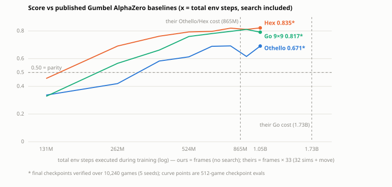

# Search-free self-play PPO vs. Gumbel AlphaZero

**Pure self-play PPO — no MCTS, no teacher, no reward shaping — beats Gumbel AlphaZero's
published baseline networks at Othello, Hex 11×11 and Go 9×9, using the exact same
network architecture and comparable compute.**

| Game | Score vs published baseline¹ | W / D / L |
|---|---:|---|
| Othello 8×8 | **0.671 ± 0.005** | 66.0 / 2.3 / 31.8 |
| Othello, compute-matched² | **0.579 ± 0.005** | 56.8 / 2.1 / 41.0 |
| Hex 11×11 | **0.835 ± 0.004** | 83.5 / – / 16.5 |
| Go 9×9 | **0.817 ± 0.004** | 81.7 / – / 18.3 |

¹ 10,240 games each (5 seeds × 1,024 random openings × both seat assignments), greedy raw
policy vs greedy raw policy — no search on either side. Opponents are Pgx's published
baselines ([Koyamada et al., NeurIPS 2023](https://arxiv.org/abs/2303.17503)), trained with
Gumbel AlphaZero (32 MCTS simulations per move).
² The iter-3000 checkpoint, whose total environment interactions (393M) are *below* the
baseline's own training cost (865M, search included).



## The controlled experiment

Everything is held fixed except the training objective:

- **Network:** an exact Flax port of Pgx's `AZNet v0` (ResNet-v2, 128 channels × 6 blocks,
  BatchNorm, tanh value head; 1.83M parameters). The port is verified **bit-exact**:
  loading their released weights reproduces their outputs with max |diff| = 0.0 and 100%
  greedy-move agreement (`pgx4/transplant_check.py`).
- **Their objective:** Gumbel AlphaZero — MCTS in the training loop generating
  search-improved targets.
- **Our objective:** PPO from sparse terminal ±1 rewards, negamax credit assignment
  (value always from the mover's perspective). No search at training or inference.
- Two ingredients make the search-free objective work:
  - **Diverse resets** (OmniReset-style): every finished game restarts from a *random legal
    mid-game position* (up to 40–50 random plies) instead of the opening. Near-terminal
    states get solved first; value propagates back to the opening.
  - **Opponent checkpoint pool:** 50% of games are played against a frozen policy snapshot
    from a 12-deep ring (pushed every 100 iters), training only on the learner's own moves.
    This removes the peak-then-drift instability of naive self-play.

## Compute accounting (symmetric: every env step executed, search included)

```
ours (each game)   8,000 iters × 4,096 envs × 32 steps           = 1,048,576,000 steps
their Othello/Hex  100 iters × 1,024 envs × 256 steps = 26.2M frames × 33¹ = 865,075,200
their Go 9×9       200 iters × 1,024 envs × 256 steps = 52.4M frames × 33¹ = 1,730,150,400
```
¹ 32 MCTS simulations + 1 played move per frame; in AlphaZero the search simulator is the
real environment. All of their figures are from §5 of the Pgx paper. We beat their Go net
using **0.61×** its environment interactions.

## Honest caveats

- The baselines are **reference models, not SOTA** — their authors' words: *"our baseline
  models are not designed to be state-of-the-art or oracle models."* Only the Go baseline
  has external calibration (beat Pachi 62–38, playing with 800-simulation search).
- Their published Elo evaluations use 32-simulation search at play time; our head-to-heads
  are raw policy vs raw policy on both sides (symmetric, but a different regime).
- All claims here are **comparative — about the training objective** — not claims of
  absolute playing strength.

## Play against the models

```bash
uv sync   # CPU is fine for play
uv run python -m pgx4.play --game othello \
    --ckpt results/checkpoints/oth-aznet-s0-final.msgpack \
    --config results/checkpoints/oth-aznet-s0-config.json \
    --human-seat 0        # you move first; --human-seat 1 to move second
```

ASCII board in the terminal (plus a `board.svg` refreshed every move); enter moves
like `d3`, or `pass`/`swap`. Same flags work with `--game hex` and `--game go_9x9`
and their checkpoints; `--selfplay` watches the model play itself. The models play
a single greedy policy move with no search.

## Reproduce

```bash
uv sync --extra cuda

# each leg is a single-GPU run (times on one RTX PRO 6000)
bash scripts/run_sweep.sh othello   # ~10h
bash scripts/run_sweep.sh hex       # ~18h
bash scripts/run_sweep.sh go        # ~12.5h

# or just verify the shipped final checkpoints (minutes):
uv run python -m pgx4.verify --game othello --model othello_v0 \
    --ckpt results/checkpoints/oth-aznet-s0-final.msgpack \
    --config results/checkpoints/oth-aznet-s0-config.json
uv run python -m pgx4.verify --game hex --model hex_v0 \
    --ckpt results/checkpoints/hex-aznet-s0-final.msgpack \
    --config results/checkpoints/hex-aznet-s0-config.json
uv run python -m pgx4.verify --game go_9x9 --model go_9x9_v0 --opening-plies 20 \
    --ckpt results/checkpoints/go9-aznet-s0-final.msgpack \
    --config results/checkpoints/go9-aznet-s0-config.json

# prove the architecture port is bit-exact against their released weights:
uv run python -m pgx4.transplant_check
```

`results/frames_vs_score.csv` holds every checkpoint's score by exact frame count
(frames = iteration × 131,072).

`pgx4/audit.py` re-runs the consistency battery behind these numbers: self-play
symmetry invariants (each agent vs itself must score exactly 0.500 — catches any
seat/reward bias in the evaluator), baseline-vs-random strength checks (~1.0 —
catches a corrupted baseline load), and a fresh-seed re-verification of all three
head-to-heads with opening-clustered standard errors. All pass.

## Files

- `pgx4/train.py` — self-play PPO trainer (diverse resets, opponent pool, negamax GAE;
  `--arch aznet` is the exact baseline architecture; `mlp`/`conv`/`transformer` also included)
- `pgx4/verify.py` — multi-seed head-to-head vs a published baseline
- `pgx4/vs_baseline.py` — quick single-eval variant
- `pgx4/transplant_check.py` — bit-exactness proof of the AZNet port
- `pgx4/az_baseline.py` — loads Pgx's haiku baselines under jax ≥ 0.11
- `pgx4/elo.py` — self-play Elo across checkpoints
- `results/checkpoints/` — the three final networks (+ Othello's compute-matched iter-3000)
